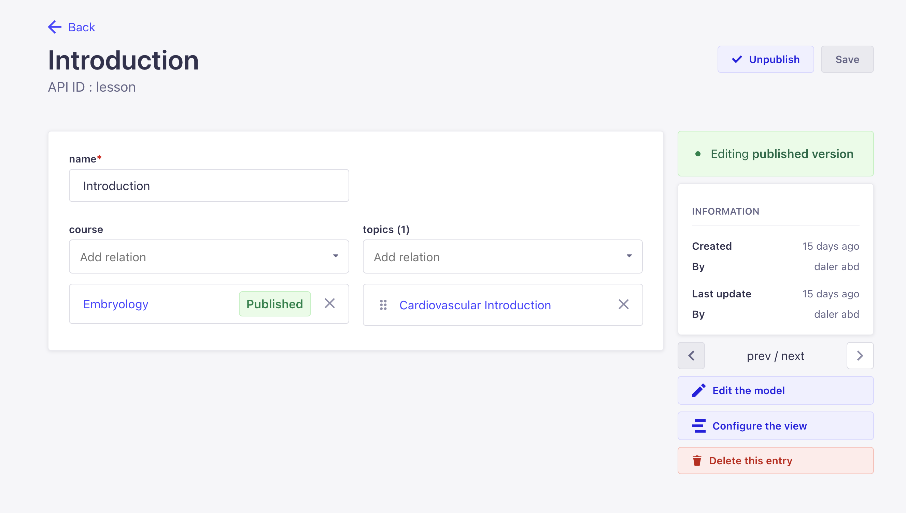
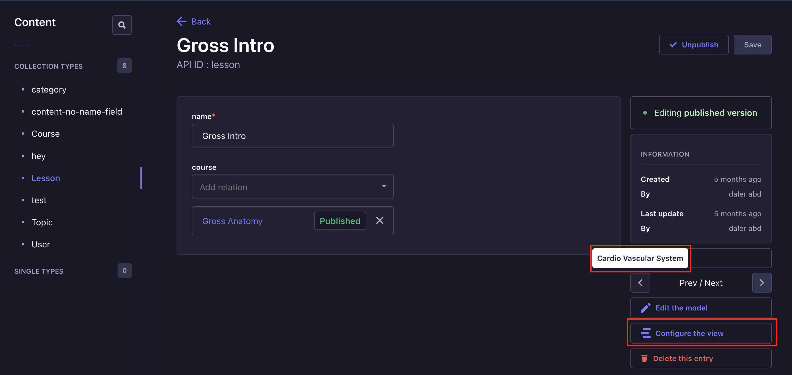

# Strapi plugin prev-next-button
<div style="text-align: center">
  
</div>


# Strapi Plugin Prev-Next Buttons
> Adds a Prev-Next Button to the edit view

## How to Install

Copy the following code and run from your terminal

```
#yarn
yarn add strapi-plugin-prev-next-button
```
```
#npm
npm install strapi-plugin-prev-next-button
```

Add the following attribute in the `config/plugins.js` file:
```
'prev-next-button': true
```
Or if you do not have the plugins.js file yet, add the file with the following contents:
```
module.exports = () => ({
  'prev-next-button': true,
});
```

## How to use
- ✨ After activation of the Plugin, click the Prev-Next Buttons will be available in the edit view for an easy navigation.



- ✨ Both buttons show prev/next entry title on hover. The title is read from `mainField` which is configured via Configure the view.



- ✨ Current implementation sorts by ID. improvements are coming soon.

